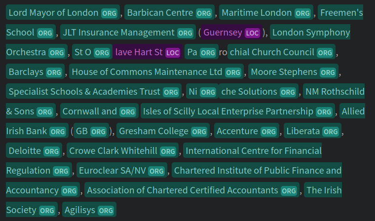
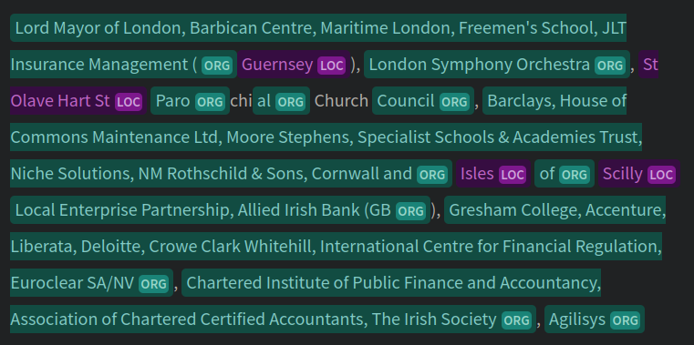

# Introduction
Lobbying scandals are a persistent source of drama in British political life. 

In recent public memory we have the seemingly-relentless kerfuffles under successive post-Brexit Conservative governments and Labour's apparent [openess to influence campaigns](https://www.opendemocracy.net/en/dark-money-investigations/lovebombed-by-lobbyists-how-starmer-labour-became-the-party-of-big-business/) under Kier Starmer, but this is a problem that has plagued every government [within my lifetime](https://www.bbc.com/news/uk-politics-22754297). In UK politics, access is a feature, not a bug.

In this series, I will do a "deep dive" on a key lobbying dataset in an attempt to better understand the UK lobbying landscape. I will use the UK ministerial meetings returns, collated by Transparency International UK (TI-UK) on their [Open Access platform](https://openaccess.transparency.org.uk/).
## My own declaration
In the spirit of transparency, I should note that I'm looking at this dataset because my brother works for TI-UK, and he keeps on bringing it up at family gatherings. 

Yes, we like to spend birthdays and Christmases talking about lobbying data: that's the way we roll.
# Planned posts
I've got three planned posts in this series:
## Data quality and time series
This post will examine **data quality** in departmental reporting. I'll dig into a dramatic improvement in the late 2010s, but find areas where there's still much work to be done.

In doing so, I'll look into patterns in reporting over time #sortout
## Fixing lobbyist reporting with LLMs
Next up, I'll take a look at one of the biggest quality issues with Ministerial returns: that lobbyists are recorded as free text. 

I'll discuss why this is a problem, and use a Large Language Model (LLM) to take a valiant shot at fixing it.
## Mapping the lobbying landscape
Once the data is effectively parse, we can start to build a picture of the people and organisations meeting with each department.

In the final post of the series, I will undertake a network analysis of UK lobbying, mapping relationships between attendees, and identifying groupings and key actors.
# Data quality

In a [2022 blog post](https://www.transparency.org.uk/uk-government-lobbying-transparency-department-disclosure-delays), TI-UK identify numerous gaps and inconsistencies in how meetings are reported across departments -- which provide declarations on their own websites, rather than in one, consolidated location.

TI find that most declarations are **submitted late**, and that several departments have **failed to submit** declarations for numerous periods. Data is also provided **infrequently**, on a quarterly basis.  

The quality of information provided about each meeting **varies dramatically between departments**, and is frequently limited to **simple and vague one-sentence reports**, such as "introductory meeting".

They also note that declarations **only cover meetings by ministers**, and not -- for example -- special advisors. Declared meetings also **only cover official meetings** and not other forms of lobbying, of the sort that might take place [at an Arsenal game](https://www.bbc.com/news/articles/c0jw193ydw6o), for example.
## Caveats
Data quality aside, a few more general words of caution in dealing with lobbying data.

**Not all lobbying is nefarious**, far from it. There are a broad array of uncontroversial reasons why a business or organisation might be meeting with a Minister. Consultations are a healthy part of government and **meetings with the least-controversial content are most likely to be reported well.**

Similarly, it is important to note that the **quantity of reported meetings can be misleading**. If a lobbyist is meeting with a department frequently, it certainly shows a strong relationship, but a number does not automatically suggest impropriety.

To neatly illustrate the above points, there is only one, single [reference in the dataset](https://openaccess.transparency.org.uk/?meeting=5570) to [Greensill Capital](https://www.bbc.com/news/uk-politics-56578838) , the organisation at the centre of on of the UK's more serious lobbying scandals of the last five years. There are, however, 80 meetings with Greenpeace.

Unfortunately, given the infrequency of reporting and the effort required to collate the data, the most recent data available at the time of writing comes from Q1 2024, **prior to the election of a Labour government.** 

This makes this exercise a little dated. I hope to revisit at some point, and at the very least, that the tools and techniques demonstrated here may be used to examine lobbying activity under a new administration.


I will combine rules-based parsing with a Large Language Model (LLM) to extract lobbyists from difficult free-text data, and demonstrate network analysis techniques to better understand the relationships between individuals, departments and lobbying organisations.


# The real problem
The above provides important context to the analysis, but the big problem from an analytical perspective is that **lobbyist records are free text**, but may may contain tens (even hundreds in some cases) of different organisations and individuals. This makes answering simple questions like "how many times did BAE systems meet a minister in 2024?" very difficult.

# Data preparation and NER
## Cleaning
I kick off with some basic data cleaning. The code is up on Github, so I'll spare you the blow-by-blow, but I do the following:
- Rename columns because I can't abide capitalisation in column names when doing analysis
- Ensure correct `dtypes` on `date` and `member_id`
- Drop eleven rows with missing lobbyist (`organisation`) or minister `rep_new`
- Fix a capitalisation typo on some Whips' office records ("Whips' office" -> "Whip's Office")
## A small time series digression
TI have already done some [great work on missing data](https://www.transparency.org.uk/uk-government-lobbying-transparency-department-disclosure-delays), and have [a whole platform](https://openaccess.transparency.org.uk/) where we can check out the number of meetings per-department, so I skip basic counts and reporting checks.

The platform doesn't do time series though, so I figured I'd check out a basic count of records per day.

![[records-day-timeseries-basic.png]]

Huh. That looks weird. We can see a few quite wild discontinuities here:
- A big drop in records per day in mid-2013
- A change from a jagged to smooth time series in mid-2017

Let's take a closer look. Go! Go! Data Science X-ray Vision.

![[records-day-timeseries-advanced.png]]

What we see here is that before mid-2017, we've got some days with very large numbers of meetings reported. Let's take a look at the top ones.

```
df.groupby(["date", "rep_new"]).size().sort_values(ascending=False).head(10)
```

```
date        rep_new                   
2016-10-01  Mr Robin Walker MP            232
2014-01-01  Rt Hon Esther McVey MP        151
2014-07-01  Rt Hon Alun Cairns MP         108
2012-03-01  Rt Hon Chris Grayling MP      101
2012-02-01  Rt Hon Chris Grayling MP       97
2013-04-01  Mr Mark Hoban                  79
2014-03-01  Rt Hon Esther McVey MP         78
2013-03-01  Mr Mark Hoban                  78
2012-10-01  Mr Mark Hoban                  68
2014-03-01  The Rt Hon. the Lord Freud     66
dtype: int64
```

Two things jump out here:
- Our Right Honourable Members here like to do their meetings with lobbyists **on the first of the month**, and can cram an inhuman number of meetings into a day.
- I'm a Worcester boy, and it tickled me to see Robin Walker (Con, Worcester, 2014-2024), son of Peter Walker (Con, Worcester, 1961-1992)[^1] top the list.

What's clearly going on here is that reporting is particularly sloppy prior to 2017. There appears to have been a practice of just reporting all meetings on the first of the month. Judging by the number of meetings our man, Robin has been doing, I'd guess some departments are reporting at least a whole quarter on the same day.

This got sorted out in 2017. We can see it very clearly when plotting the proportion of meetings on the first of the month each year.

![[records-first-day.png]]

I also ran the length of the meeting description, which I felt might be a decent proxy for the amount of effort put into reporting. Here we see more of a gradual improvement over time, but also that the average length of descriptions has doubled pre- and post- 2017.

![[records-length.png]]

So what happened? I asked my brother and he explained that Teresa May was responsible. A [bollocking was issued](https://www.gov.uk/government/publications/letter-from-the-prime-minister-on-government-transparency-and-open-data), things improved. Go Teresa!

![[theresa-may-prime-minister.gif]]

# Extracting lobbyists

Getting back to our original problem.

Records use a variety of spellings, delimiters, capitalisation schemas, and approaches to acronym use. To confuse things further, sometimes individuals are reported, sometimes organisations, often both. 
## Examples
Here are a few examples to give you an idea of the problem, we have:

Single records:
> Social Care Institute for Excellence

Comma delimitation of organisations only:
> Standard Chartered, HSBC Thailand, Abdrn, Securities and Exchange Commission of Thailand, Thai Bankers Association, EXIM Bank Thailand, SCBx

Mixed comma and semi-colon delimitation of individuals, roles and organisations:
> R&D Advisors; Giffard Netwon & Sons, Managing Director; Medfac UK Ltd/ Kinetec Medical Products UK Ltd, Managing Director

Ampersand delimitation:
> Sir Daniel Bethlehem QC & Sir Jeffery Jowell QC

Ampersands in names:
> Aon Ltd, Ernst & Young

"And" delimitation _and_ comma delimitation:
> Hugo Foreshaw and Nick Emmerson, Law society

Some are just very long indeed:
> Ashford Council, Arun Council, Ashfield Council, Barnet Council, Amber Valley Council, Barnsley Council, Basildon Council, Bassetlaw Council, Bedford Council, Basingtonstoke Council, Bath and North East Somerset Council, London Borough of Barking and Dagenham, Babergh Distict Council, Adur and Worthing District Council, Bexley Council, Birmingham Council, Home Office... *and on for another 6,787 characters.*

And some are incomplete:
> Under-Secretary-General for \[..., that's it.]

Oh, and the text encoding in the source data is shot.
> Fair Shot Caf�

You get the picture, it's chaos.

What we need to do is **reliably take each of these free text records and produce a list of individuals and organisations named**. From there, we can attempt some more rigorous analysis.

A great solution would also involve disambiguation, e.g., linking "British Gas" and "British Gas Plc.", but at this stage, I'll settle for just breaking up each record in a sane and relatively accurate way.
### Reducing search space
Before we get into extracting the entities, we'll want to narrow down our targets a bit. The length of the whole dataset is a little north of 100K records, and the more rows we hit, the longer it'll take and the greater the risk of error.
### Deduplication
The first and simplest thing we can do remove duplicates. We know from just looking at the [portal](https://openaccess.transparency.org.uk/) there are plenty of records which contain a single organisation, and that they account for a lot of the rows. 

![[openaccess-screen-lobbyists.png]]
*Screenshot from openaccess.transparency.org.uk*, October 24, 2024.

Creating a new table for lobbyists and dropping duplicates gives us 61,241 unique rows to chew through.
### Single and multiple-entity records
The most important step is to separate as many single-entity records (e.g., "British Gas") from multiple-entity records (e.g., "British Gas, ExxonMobil, BP and Shell") as we can. 

We'll run entity extraction across multiple-entity records, which *should* pick up single entries, so we don't care about false positives in this direction. Conversely, we'd like to avoid false positives in the single-entity pile as we'll be automatically recording them as a single-entity.

We can apply some heuristics here to help us out:
#### Frequency
Single entry records are more likely to occur multiple times in the dataset. We can see this from the visualisation in the portal.

It makes intuitive sense: one-to-one meetings with a given organisation or person will be recorded with greater consistency than the many possible permutations of a string representing a meeting with multiple actors.
#### Length
Single entry records are likely to be shorter than multiple entry records, though not always, as "BP and Exxon" is considerably shorter than "The Worldwide Fund for Nature". 

This noted, there will be a point a which


## Previous attempts
I've taken a few runs at this problem over the years. The first time, shortly after initially learning some Python, was a very brave initial attempt with a rules-based parser -- trying to split on commas and other delimiters. This went very badly indeed.

A second attempt, after getting into NLP, involved reaching for off-the-shelf [named entity recognition (NER)](https://huggingface.co/models?pipeline_tag=token-classification) tools from [Huggingface](https://huggingface.co). I've had reasonable success with `dslim/bert-large-NER` in the past, but found it lacking for this task.


_`dslim/bert-large-NER` from Huggingface's [online GUI](https://huggingface.co/dslim/bert-large-NER?text=Lord+Mayor+of+London%2C+Barbican+Centre%2C+Maritime+London%2C+Freemen%27s+School%2C+JLT+Insurance+Management+%28Guernsey%29%2C+London+Symphony+Orchestra%2C+St+Olave+Hart+St+Parochial+Church+Council%2C+Barclays%2C+House+of+Commons+Maintenance+Ltd%2C+Moore+Stephens%2C+Specialist+Schools+%26+Academies+Trust%2C+Niche+Solutions%2C+NM+Rothschild+%26+Sons%2C+Cornwall+and+Isles+of+Scilly+Local+Enterprise+Partnership%2C+Allied+Irish+Bank+%28GB%29%2C+Gresham+College%2C+Accenture%2C+Liberata%2C+Deloitte%2C+Crowe+Clark+Whitehill%2C+International+Centre+for+Financial+Regulation%2C+Euroclear+SA%2FNV%2C+Chartered+Institute+of+Public+Finance+and+Accountancy%2C+Association+of+Chartered+Certified+Accountants%2C+The+Irish+Society%2C+Agilisys)_

`bert-large-NER` performd relatively well, but notice how it struggles with locations, "St Olave Hart St Parochial Church Council" and "Niche Solutions". These sorts of issues were plentiful, hard to identify, and scaled very badly in testing.

I also tried `FacebookAI/xlm-roberta-large-finetuned-conll03-english` whilst writing this piece to see if newer NER models performed any better. They didn't. See the single entity starting with "Gresham College".


_`FacebookAI/xlm-roberta-large-finetuned-conll03-english` from Huggingface's [online GUI](https://huggingface.co/FacebookAI/xlm-roberta-large-finetuned-conll03-english?text=Lord+Mayor+of+London%2C+Barbican+Centre%2C+Maritime+London%2C+Freemen%27s+School%2C+JLT+Insurance+Management+%28Guernsey%29%2C+London+Symphony+Orchestra%2C+St+Olave+Hart+St+Parochial+Church+Council%2C+Barclays%2C+House+of+Commons+Maintenance+Ltd%2C+Moore+Stephens%2C+Specialist+Schools+%26+Academies+Trust%2C+Niche+Solutions%2C+NM+Rothschild+%26+Sons%2C+Cornwall+and+Isles+of+Scilly+Local+Enterprise+Partnership%2C+Allied+Irish+Bank+%28GB%29%2C+Gresham+College%2C+Accenture%2C+Liberata%2C+Deloitte%2C+Crowe+Clark+Whitehill%2C+International+Centre+for+Financial+Regulation%2C+Euroclear+SA%2FNV%2C+Chartered+Institute+of+Public+Finance+and+Accountancy%2C+Association+of+Chartered+Certified+Accountants%2C+The+Irish+Society%2C+Agilisys)_
I also found that the off-the-shelf models struggled with longer records, running into context-length limitations. This could have potentially have been resolved with some clever chunking, but at the cost of additional complexity.

Anyway, things have moved on in the last few years.
## Large Language Models
Large Language Modells (LLMs), such as OpenAI's ChatGPT, are powerful, flexible, and often unpredictable text processing engines. 

Such models have a number of properties which lend themselves well to our use case:
- LLMs are (more or less) capable of providing **structured output**, or -- as we'll see -- at the very least able to improve on poorly-structured inputs.
- They're **unfussy about input quality** and data structure, unlike rules based engines.
- They're trained on huge corpora, across multiple domains and languages, which make them far more **adaptable** than traditional NER models. A single model can be used for a range of tasks.
- They're also able to handle **substantially longer documents** than existing NER models, reducing the need for additional code to manage chunking of inputs.

They also carry a number of limitations and risks:
- They are notoriously prone to **hallucination**, i.e., producing output that is [not grounded in reality](https://aclanthology.org/2021.eacl-main.236/)
- With regard to structured data output, I've found LLMs to be incredibly **brittle**. Small variations in prompting can produce radically different results, and prompts that work well with one sort of document can fail to generalize to others. I'll dig deeper into this in another article.
- APIs for the big names (e.g., ChatGPT, Claude) **come with a price-tag**. This is fine for smaller batches, but can add up, particularly when taking testing into account. There are plenty of ways around the problem, but a simple, naive approach to parsing lobbying records would involve over 100,000 API calls.
- Not an issue for this use case, but for others, passing **sensitive data** to a third-party for processing is unwise. Some providers may be able to provide stronger guarantees of privacy than others, but often at increased cost.
## Enter the Llama


# Network analysis


[^1]: Yes, Worcester has been run by (dudes from) the same family for 41 out of the last 63 years. Feudalism is alive and well in my country.

# Scraps


[Transparency International UK (TI-UK)](https://www.transparency.org.uk/) aggregate declarations made by ministers under the [Ministerial Code](https://www.gov.uk/government/publications/ministerial-code) on their [Open Access Platform](https://openaccess.transparency.org.uk). It's a fantastic tool for exploring lobbying activity, but issues with source data quality really limit analytical work on the dataset.
